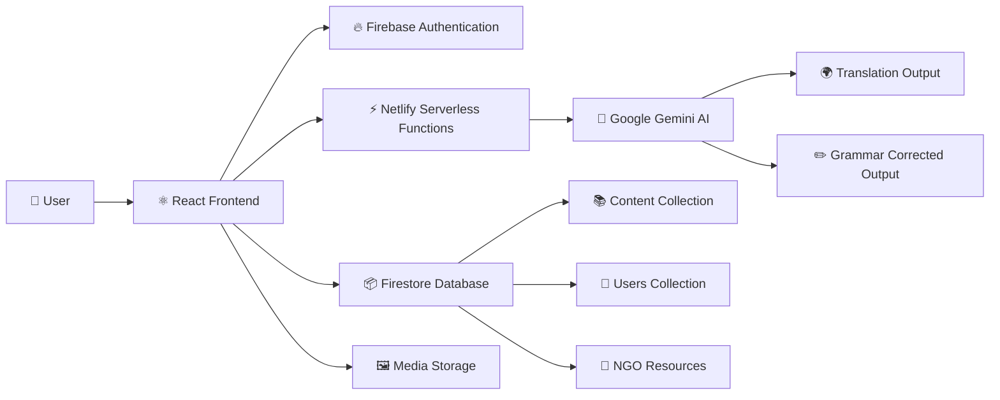
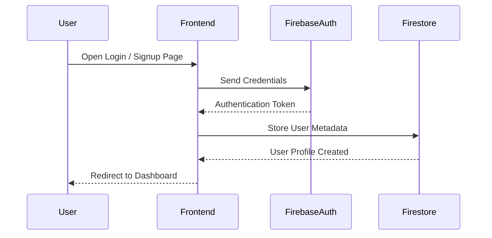
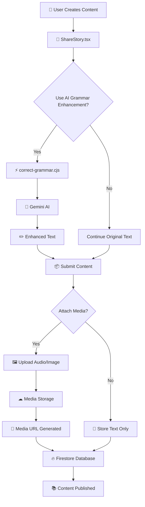
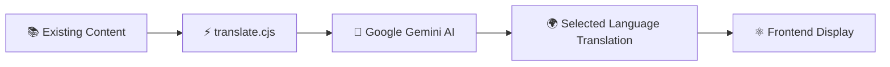
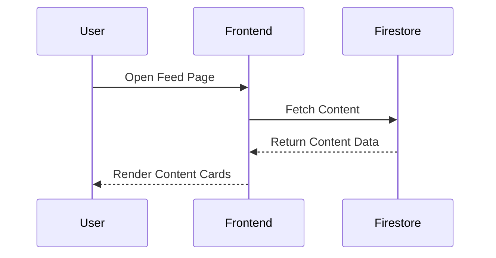
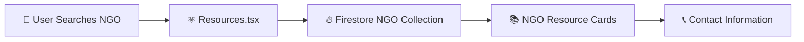
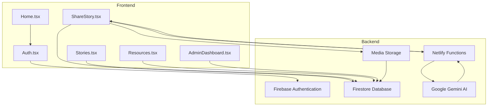
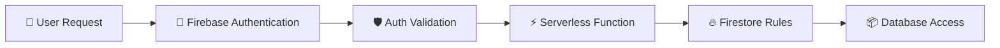
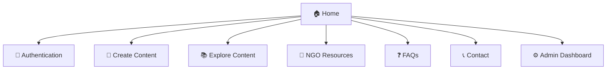
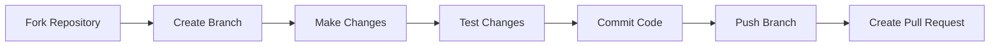

# 🌐 SafeVoice – AI-Powered Anonymous Support Platform

> A secure, AI-assisted platform where users can anonymously express experiences, access NGO support resources, translate content into regional languages, and safely communicate without exposing identity.

---

# 🚀 Live Demo

🔗 SafeVoice on Netlify

---

# 📌 About The Platform

SafeVoice is a privacy-focused web platform designed to provide a safe digital environment for individuals to anonymously express experiences related to harassment, abuse, discrimination, emotional distress, or social issues.

The platform integrates:

- 🔐 Secure Authentication
- 🧠 AI-powered Text Enhancement
- 🌍 Multilingual Translation
- 🖼️ Media Upload Support
- 📚 NGO Resource Discovery
- ⚡ Serverless Backend Infrastructure

The architecture prioritizes:

- Privacy-first design
- Scalability
- Performance optimization
- Modular backend services
- Beginner-friendly open-source contribution

---

# ✨ Features

| Feature | Description |
|---|---|
| 📝 Anonymous Publishing | Create, edit, and manage content without exposing identity |
| 🌍 AI Translation | Translate content into multiple Indian languages |
| ✏️ AI Grammar Enhancement | Improve text quality before publishing |
| 🖼️ Media Uploads | Upload audio recordings and images |
| 🔐 Secure Authentication | Firebase-based login & signup |
| 📚 NGO Resource Hub | Browse verified support organizations |
| ⚡ Serverless APIs | Lightweight backend using Netlify Functions |
| 🛡️ Abuse Protection | Rate limiting and secured API access |

---

# 🏗️ High-Level Architecture



---

# 🔄 Complete Platform Workflow

## 1️⃣ Authentication Lifecycle



### Internal Flow

- Firebase Authentication validates credentials
- Session tokens are generated securely
- User metadata is stored in Firestore
- Public content remains detached from identity

---

## 2️⃣ Content Creation Lifecycle



---

## 3️⃣ AI Translation Lifecycle



### Translation Benefits

- Regional accessibility
- Cross-language communication
- Better outreach for support systems

---

## 4️⃣ Content Retrieval Workflow



### Retrieved Data

- Anonymous content
- Media URLs
- Timestamp metadata
- Translation versions

---

## 5️⃣ NGO Resource Hub Workflow



---

# 🧠 Backend-to-Frontend Detailed Architecture



---

# 🔐 Security & Privacy Architecture

## Privacy Principles

- Anonymous publishing
- Minimal personally identifiable information
- Secure authentication flow
- Protected backend APIs
- Firestore security rules
- Abuse prevention mechanisms

---

## Security Workflow



---

# ⚡ API Architecture

| Endpoint | Purpose |
|---|---|
| correct-grammar.cjs | AI grammar enhancement |
| translate.cjs | Multi-language translation |
| subscribe.cjs | Newsletter/email subscriptions |

---

# 📂 Project Structure

```bash
SafeVoice/
│
├── .github/
│   └── ISSUE_TEMPLATE/
│
├── netlify/
│   └── functions/
│       ├── correct-grammar.cjs
│       ├── subscribe.cjs
│       └── translate.cjs
│
├── public/
│   └── _redirects
│
├── src/
│   ├── components/
│   ├── context/
│   ├── lib/
│   ├── pages/
│   ├── App.tsx
│   ├── main.tsx
│   └── index.css
│
├── README.md
├── package.json
├── netlify.toml
└── vite.config.js
```

---

# ⚙️ Tech Stack

| Layer | Technology |
|---|---|
| Frontend | React + TypeScript + Tailwind CSS |
| Backend | Firebase + Netlify Functions |
| Database | Firestore |
| Authentication | Firebase Auth |
| AI Integration | Google Gemini AI |
| Deployment | Netlify |
| Storage | Cloud Storage / External Storage |

---

# 📈 Scalability Design

SafeVoice uses a modular serverless architecture.

### Benefits

- ⚡ Faster deployments
- 📈 Easy horizontal scaling
- 💸 Lower infrastructure costs
- 🔧 Independent backend functions
- 🌍 CDN delivery via Netlify

---

# 🧩 Frontend Routing Structure



---

# 🛠️ Installation & Setup

## 1️⃣ Clone Repository

```bash
git clone https://github.com/Piyushydv08/SafeVoice.git
cd SafeVoice
```

---

## 2️⃣ Install Dependencies

```bash
npm install
npm install -g firebase-tools
npm install -g netlify-cli
```

---

## 3️⃣ Configure Environment Variables

Create a `.env` file in the root directory.

Add:

- Firebase configuration keys
- Gemini AI API keys
- Storage configuration values

---

## 4️⃣ Start Development Server

```bash
netlify dev
```

---

# ▶️ Usage Guide

1. Open the platform in browser
2. Sign up securely using Firebase Auth
3. Create anonymous content
4. Attach optional media
5. Improve text using AI grammar enhancement
6. Translate content into regional languages
7. Browse NGO support resources

---

# 🤝 Contributing

Contributions are welcome from developers of all experience levels.

---

## Contribution Workflow



---

# 🌟 GSSoC'26 Participation

SafeVoice is officially part of GirlScript Summer of Code 2026.

Contributors can:

- Improve frontend UI/UX
- Build backend APIs
- Add AI integrations
- Improve accessibility
- Enhance documentation
- Optimize performance

---

# 📧 Contact

## Maintainers

- Aditi Raj
- Piyush Yadav

### Support Channels

- GitHub Issues
- Pull Request Discussions
- LinkedIn Profiles

---

# 📄 License

Licensed under the MIT License.

---

# ⭐ Support The Project

If you found this project useful:

- ⭐ Star the repository
- 🍴 Fork the project
- 🧑‍💻 Contribute improvements
- 📢 Share with others

---

# 💙 SafeVoice Mission

> “Creating a secure space where voices can be heard safely, anonymously, and without fear.”
